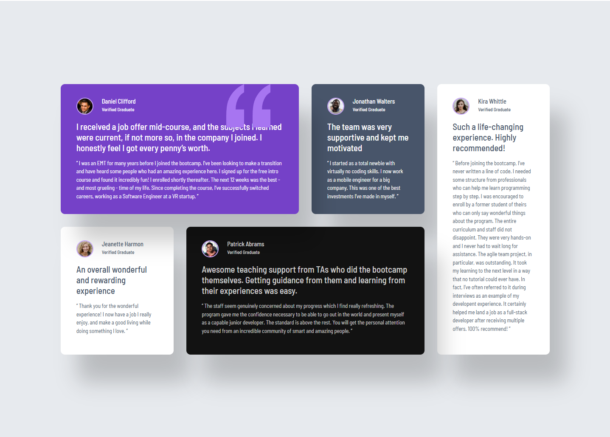

# Frontend Mentor - Testimonials grid section solution

This is a solution to the [Testimonials grid section challenge on Frontend Mentor](https://www.frontendmentor.io/challenges/testimonials-grid-section-Nnw6J7Un7). Frontend Mentor challenges help you improve your coding skills by building realistic projects.

## Table of contents

- [Overview](#overview)
  - [The challenge](#the-challenge)
  - [Screenshot](#screenshot)
  - [Links](#links)
- [My process](#my-process)
  - [Built with](#built-with)
  - [What I learned](#what-i-learned)
  - [Continued development](#continued-development)
- [Acknowledgments](#acknowledgments)

**Note: Delete this note and update the table of contents based on what sections you keep.**

## Overview

### The challenge

Users should be able to:

- View the optimal layout for the site depending on their device's screen size

### Screenshot




### Links

- Solution URL: [Add solution URL here](https://github.com/tortiman/testimonial_grid_section)
- Live Site URL: [Add live site URL here](https://tortiman.github.io/testimonial_grid_section/)

## My process

### Built with

- Semantic HTML5 markup
- CSS custom properties
- Flexbox
- CSS Grid
- Mobile-first workflow

### What I learned

I am learning how adjust correctly the elements in the grid.

To see how you can add code snippets, see below:

```css
.container {
  background-color: var(--GreyNeutral100);
  display: grid;
  grid-template-columns: 1fr 1fr 1fr 1fr;
  grid-template-rows: 1fr 1fr;
  width: 80%;
  height: 62%;
  justify-content: center;
  align-items: center;
  gap: 30px;
}

.daniel {
  background-color: var(--PurplePrimary500);
  grid-column: 1 / 3;
  grid-row: 1 / 1;
  color: var(--WhiteNeutral);
  /* padding: 30px; */
  border-radius: 10px;
  position: relative;
  box-shadow: 40px 65px 50px rgba(0, 0, 0, 0.2);
}

.quote {
  position: absolute;
  transform: translateX(390px);
  z-index: 0;
}

.jonathan {
  background-color: var(--GreyNeutral500);
  grid-column: 3 / 4;
  grid-row: 1 / 1;
  color: var(--WhiteNeutral);
  border-radius: 10px;
  box-shadow: 40px 65px 50px rgba(0, 0, 0, 0.2);
}

.kira {
  background-color: var(--WhiteNeutral);
  grid-column: 4 / 5;
  grid-row: 1 / 3;
  border-radius: 10px;
  height: 100%;
  box-shadow: 40px 65px 50px rgba(0, 0, 0, 0.2);
}

.jeannete {
  background-color: var(--WhiteNeutral);
  grid-column: 1 / 2;
  grid-row: 2 / 2;
  border-radius: 10px;
  height: 100%;
  box-shadow: 40px 65px 50px rgba(0, 0, 0, 0.2);
}

.patrick {
  background-color: var(--BlackNeutral);
  grid-column: 2 / 4;
  grid-row: 2 / 2;
  color: var(--WhiteNeutral);
  border-radius: 10px;
  height: 100%;
  box-shadow: 40px 65px 50px rgba(0, 0, 0, 0.2);
}
```

### Continued development

I don't get the situation of the elements in the responsive design. I have to use margin-top to show the first element of the grid. So I don't know how to send to the bottom the quote image, I used z-index property but doesn't work.

```css
@media (width<700px) {
  .main {
    height: auto;
  }
  .container {
    margin-top: 1000px;
    grid-template-columns: 1fr;
    align-content: center;
  }

  .daniel,
  .jonathan,
  .kira,
  .jeannete,
  .patrick {
    grid-column: auto;
    grid-row: auto;
    width: 350px;
    justify-self: center;
  }

  .quote {
    visibility: hidden;
  }
}
```

## Acknowledgments

This is where you can give a hat tip to anyone who helped you out on this project. Perhaps you worked in a team or got some inspiration from someone else's solution. This is the perfect place to give them some credit.

**Note: Delete this note and edit this section's content as necessary. If you completed this challenge by yourself, feel free to delete this section entirely.**
